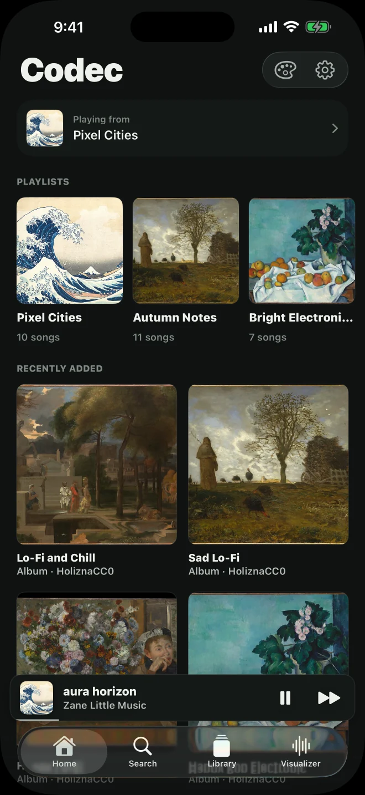
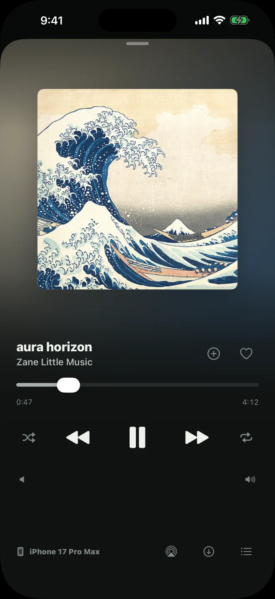

<p align="center">
  
</p>

# Codec

Codec is a self-hosted music player. Run the server, add your music files, and
listen through the web player or the iPhone/iPad app. The server stores your
library, playlists, artwork and playback state. Each device plays its own audio.

[Project site](https://codec.codie.sh) · [Documentation](https://codec.codie.sh/docs.html) · [Server downloads](https://github.com/urlocalgoose/codec/releases/latest)

<p align="center">
  
  
</p>

## What it does

- Plays the music files you add to your server. No music catalog is included.
- Keeps playlists, likes and playback state available across connected devices.
- Moves playback to another connected device with its queue and position.
- Saves songs for offline listening on iPhone and iPad.
- Supports custom playlist covers, 33 color palettes and a live visualizer
  that uses colors from the song’s artwork.
- Lets invited Aux participants browse music and add to a shared queue.

The web player works in a browser, including on computers. The SwiftUI app is a
separate iPhone/iPad client. This release distributes the server and web player;
iOS distribution is managed separately.

## Run the server

The current server release supports **Linux amd64 and arm64**. Each archive
contains the Go server, built web player, Ubuntu/systemd installer and checksums.
It starts with an empty library; your music and auth token are never included in
a release download.

Start with [Hosting Codec](https://codec.codie.sh/docs/hosting.html), or use the
[included release guide](docs/server-release.md). Keep the archive and its
matching `.sha256` file together. The installer keeps persistent data separate
from application updates and generates an auth token for a new server.

The web player comes with the Go server. It does not need a separate Node server,
database service or website deployment. To listen from outside your network,
make the server reachable through HTTPS or a private network such as Tailscale.

## The Loud format

A Loud bundle is a folder or `.loud.zip` with a `loud.import.v1` JSON manifest,
audio and optional artwork. It is a way to move music collections, not an audio
encoding. Fingerprints identify songs; playlists and likes reference those songs.

- [Format guide and examples](https://codec.codie.sh/docs/loud.html)
- [Manifest reference](docs/codec-import-v1.md) and [JSON Schema](docs/codec-import.schema.json)
- [Track artwork example](site/examples/track-artwork.json)
- [Playlist artwork example](site/examples/playlist-artwork.json)

Use **Settings → Import music** in the web player to upload a bundle. Server
imports add missing tracks and playlist members while preserving existing
metadata, likes, order and custom covers. Each song occurs at most once in a
playlist; repeated source entries collapse. Refresh the phone library after
import to receive the music and artwork.

## Documentation and source

Documentation has two parts:

1. **Using Codec:** [Loud bundles](https://codec.codie.sh/docs/loud.html) and
   [server setup](https://codec.codie.sh/docs/hosting.html).
2. **Code reference:** [how the parts fit together](https://codec.codie.sh/docs/code.html),
   file locations, contracts and build/test commands.

The [repository docs index](docs/README.md) links the source references. Start
in `sync-server/` for the Go server, `src/` for the Svelte web player,
`ios/CodecMobile/` for the Swift app, and `site/` for the static project website.

```sh
bun install --frozen-lockfile
bun run dev                    # Web development
bun run build                  # Built web player in build/
go -C sync-server build ./cmd/codec-sync-server
open ios/CodecMobile/Codec.xcodeproj   # iOS project; requires macOS/Xcode
```

```sh
bun run check
bun run test:frontend
bun run test:server
(cd ios/CodecMobile && swift test)   # CodecKit client/model tests
```

The phone’s app-hosted playback and rendering tests are separate from
`swift test`; see [native test scopes](ios/CodecMobile/Tests/README.md).
The [optional import-tool reference](https://codec.codie.sh/docs/code.html#importing)
covers the separate source-built CLI and its tests. It is not part of the server
download or a requirement for uploading music through the web player.

## Contributions

We’re not accepting contributions or pull requests right now. The source is
available to read and use under the MIT license. See [CONTRIBUTING.md](CONTRIBUTING.md).

## Names and compatibility

Codec used to be called Loud. The `loud.*` wire schemas, `.loud/` local state
folder and `loud://` identifiers keep their original names so existing libraries
and clients continue to work. New setup uses `CODEC_AUTH_TOKEN`; the old
`LOUD_AUTH_TOKEN` name remains an alias.

## License

MIT. The screenshots use a separate licensed demo collection; its music is not
included with Codec. [Screenshot credits](https://codec.codie.sh/credits.html).
