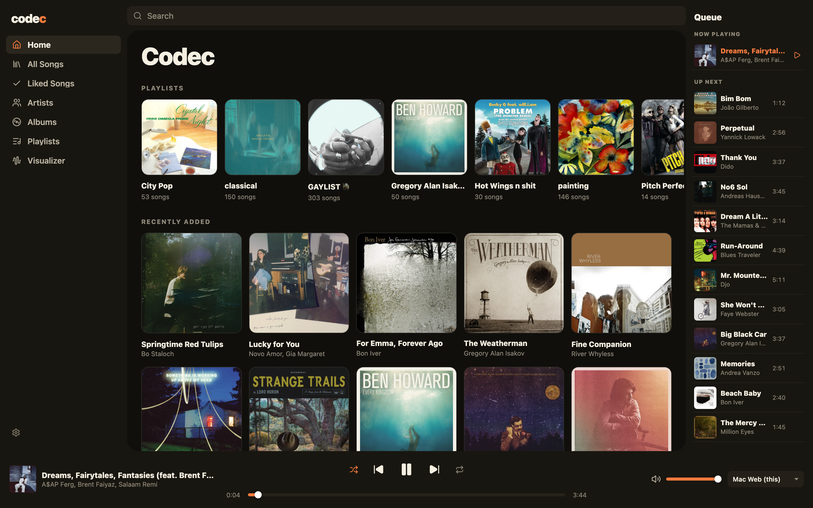
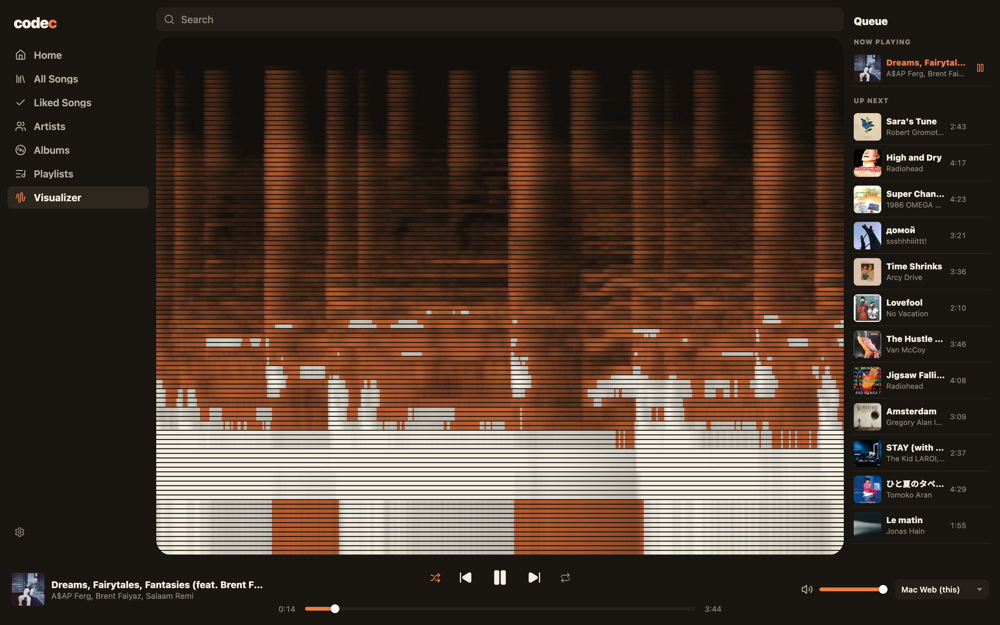
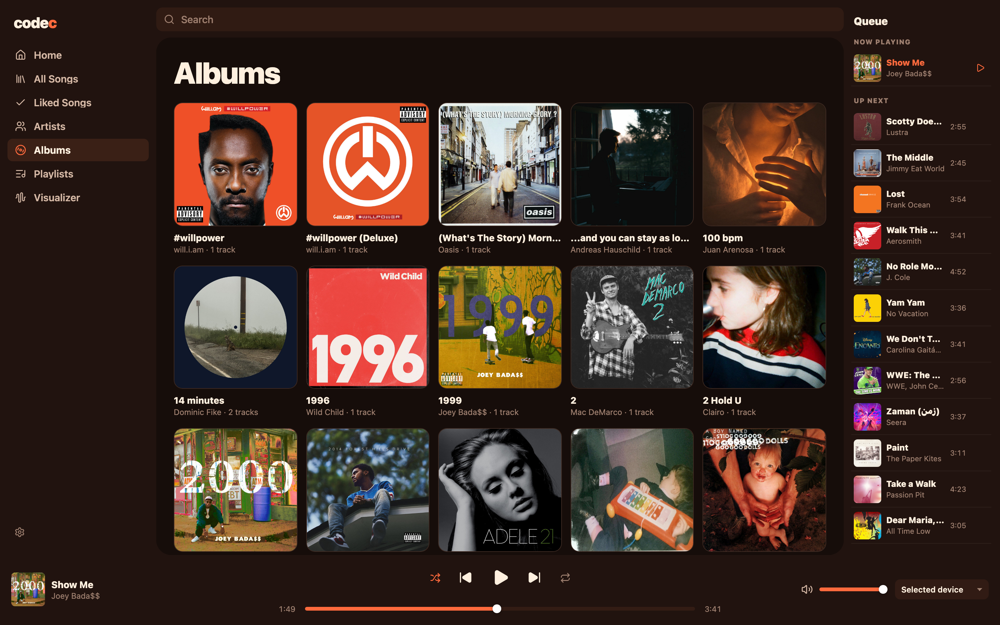
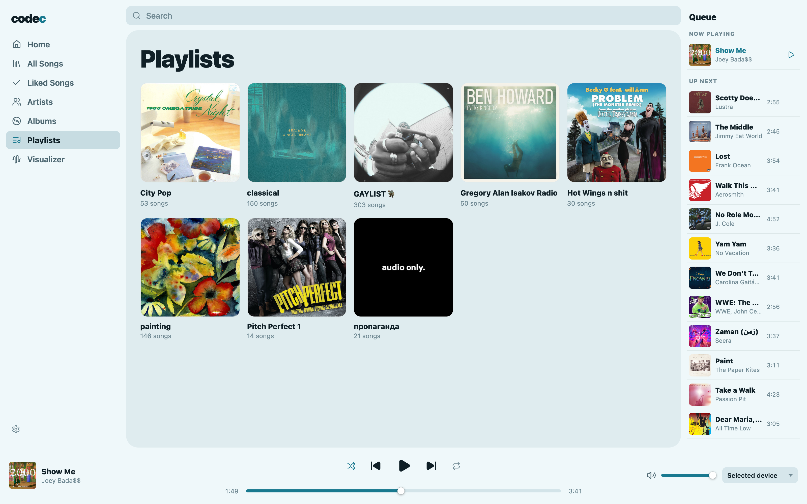
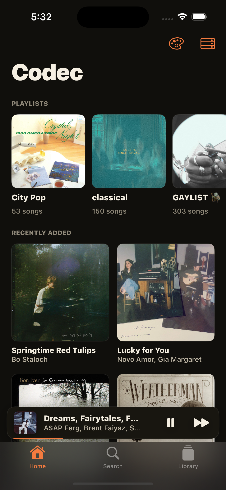
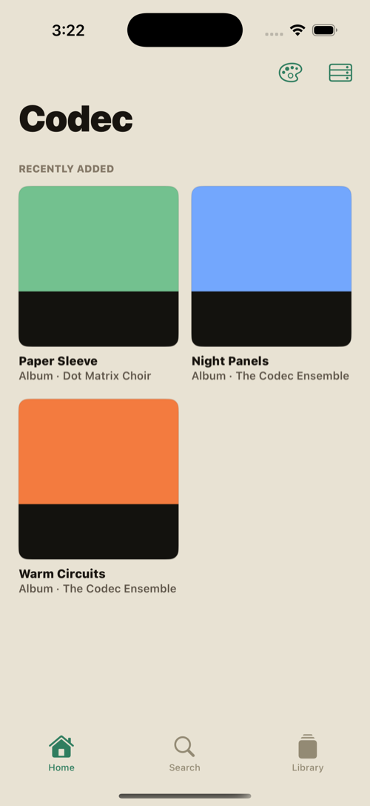

<p align="center">
  
</p>

# Codec

Codec is a music player for people who keep their music as files. You run a
small server wherever you want, point it at your library, and every device
you own can browse, stream, and pick up playback where another left off.
There are no accounts and nothing phones home. The whole thing is one Go
binary, a web app it serves, a desktop app, and an iOS app.

It's built for one person. One library, one token, as many devices as you
like. If you want multi-user, this isn't that.

<p align="center">
  
</p>
<p align="center">
  
</p>

Every screen is themed — there are 33 themes and they carry through the web
app and the iOS app, down to the QR codes:

<p align="center">
  
  
</p>
<p align="center">
  
  
</p>

## What it does

You get the things you'd expect: playlists, likes, search, album and artist
browsing, a queue you can reorder, and gapless-enough playback in the
browser, on desktop, and on iOS. Then the parts that make it feel like one
system instead of three apps:

- Playback follows you. Start a song on your Mac, flip it to your phone from
  the "Playing on" picker, and the queue and position come along.
- Aux is shared listening: you start one, friends scan a QR code, and they
  can browse your library and push songs onto the queue from their phones.
  They can't touch your playlists or likes, and their access dies when you
  end the aux.
- The visualizer draws a live spectrograph of whatever's playing, in your
  theme's colors. It keeps recording while you're on other screens, so
  opening it mid-song shows the last half minute instead of a blank wall.
  Double-click for fullscreen.
- Playlists can have custom covers. Set them from the web or the iOS photo
  picker.
- The library loads instantly after the first visit — clients keep a local
  copy and refresh it in the background, which also means you can read your
  library offline.

## Get it running

Grab the server zip for your platform from
[Releases](https://github.com/urlocalgoose/codec/releases) — the desktop app
installers (macOS dmg, Linux AppImage/deb, Windows installer) live there
too. Unzip the server and run it:

```bash
./codec-sync-server
```

First run asks three questions — where to keep data, what port, and whether
to protect the server with an auth token (say yes; it generates one for
you). Answers are saved to `~/.codec/server.json`, so from then on it just
starts. Re-run with `--setup` to change your mind about any of it.

Open the URL it prints. That URL is the web app, the API, and the sync
target, all one thing. On your phone, use the LAN address and Add to Home
Screen to get a real app out of it. macOS will complain the binary is
unsigned the first time — right-click → Open, or
`xattr -d com.apple.quarantine codec-sync-server`.

To reach it from outside your network, put HTTPS in front (Cloudflare
Tunnel, Caddy, nginx — anything). Notes in [DEPLOY.md](DEPLOY.md), phone
details in [docs/iphone.md](docs/iphone.md), the security model in
[docs/secure-sync.md](docs/secure-sync.md).

### About the token

The token is Codec's entire auth story, on purpose. You invent one secret
(or let setup generate it), start the server with it, and paste it into each
app once. Browsers hitting the raw URL get a password prompt — the token is
the password, username doesn't matter. Under the hood, clients trade it for
short-lived stream tokens so your real secret never ends up in media URLs or
proxy logs. No token means an open server, which is fine on a trusted LAN
and a terrible idea on the internet.

## The loud format

Libraries move around as **bundles**: one `.loud.zip` holding a
[`loud.import.v1`](docs/codec-import-v1.md) manifest plus all the audio.
The manifest carries titles, likes, playlists, and stable identities (ISRC,
MusicBrainz, Spotify/YouTube IDs, or normalized tags), so a bundle is a
complete, self-contained library — no folder layout to preserve, nothing
depending on where files happen to live.

That makes sharing trivial. Settings → Share library gives you
`library.loud.zip`; hand it to anyone running Codec and they import it with
one pick — identity matching means they only gain the songs they don't
already have, and your playlists and likes come along for the ones they
take. If you write a downloader or migration tool, produce bundles. It's the
format everything else in Codec speaks.

## Getting music in

- **A bundle or manifest**: Settings → Import music, pick the `.loud.zip`
  (or a manifest with its files). Likes and playlists apply, duplicates
  skip.
- **Plain MP3s**: same place. Tags are read right in the browser and
  identity is derived the same way, so even bare files dedupe properly.
- **The desktop app**: point it at a folder of music; it scans, plays
  locally, and syncs to the server when you tell it to.
- **Scripted**: `codec_import` imports manifests headlessly, and
  [`codec-add`](scripts/codec-add.sh) chains a downloader into it — playlist
  link in, songs on every device out.

## Building from source

You'll want [Bun](https://bun.sh), [Go](https://go.dev), and — for the
desktop and iOS apps — [Rust](https://rustup.rs) and Xcode.

```bash
bun install
bun run server:dev     # build the web app, run the server on :8787
bun run tauri dev      # the desktop app
open ios/CodecMobile/Codec.xcodeproj   # the iOS app
```

Tests, if you're changing things:

```bash
bun run check && bun test                # web
cd sync-server && go test ./...          # server
cargo test --manifest-path src-tauri/Cargo.toml   # rust core
cd ios/CodecMobile && swift test          # ios client
```

The layout is what you'd guess: `src/` is the Svelte app, `sync-server/` is
the Go server, `src-tauri/` is the Rust core behind the desktop app,
`ios/CodecMobile/` is SwiftUI. Contracts and guides live in `docs/` —
[codec-sync.md](docs/codec-sync.md) for the API,
[ui-system.md](docs/ui-system.md) for the visual language,
[modding.md](docs/modding.md) for where to change what.

## Why "loud" is everywhere

Codec used to be called Loud. The wire schemas (`loud.sync.v1`,
`loud.playback.v2`, `loud.import.v1`), the `.loud/` state folder, and
`loud://` paths keep the old name so nobody's library breaks on a rename.
They're protocol IDs now, nothing more. `LOUD_AUTH_TOKEN` still works too,
but use `CODEC_AUTH_TOKEN`.

## License

MIT
